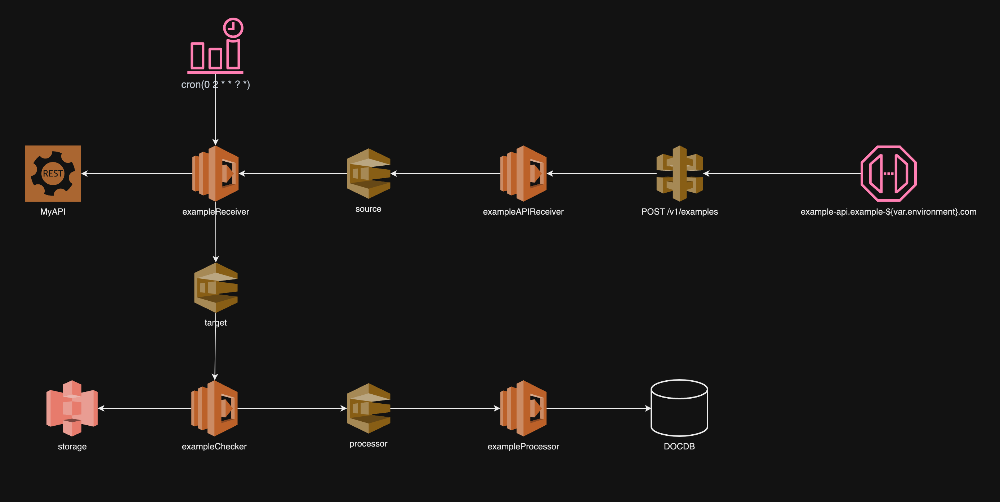

# example

<div style="text-align:center"></div>

- [diagram.drawio.xml](diagram.drawio.xml)
- [structure.yaml](structure.yaml)

## Commands
```bash
$ aws-terraform-generator diagram -s mystack -c diagram.config.yaml -d diagram.drawio.xml -o mystack.yaml
$ aws-terraform-generator structure -c structure.yaml -o ./output
$ aws-terraform-generator apigateway -c mystack.yaml -o ./output
$ aws-terraform-generator lambda -c mystack.yaml -o ./output/mystack
$ aws-terraform-generator sqs -c mystack.yaml -o output/mystack/mod/sqs.tf
$ aws-terraform-generator s3 -c mystack.yaml -o output/mystack/mod/s3.tf
```